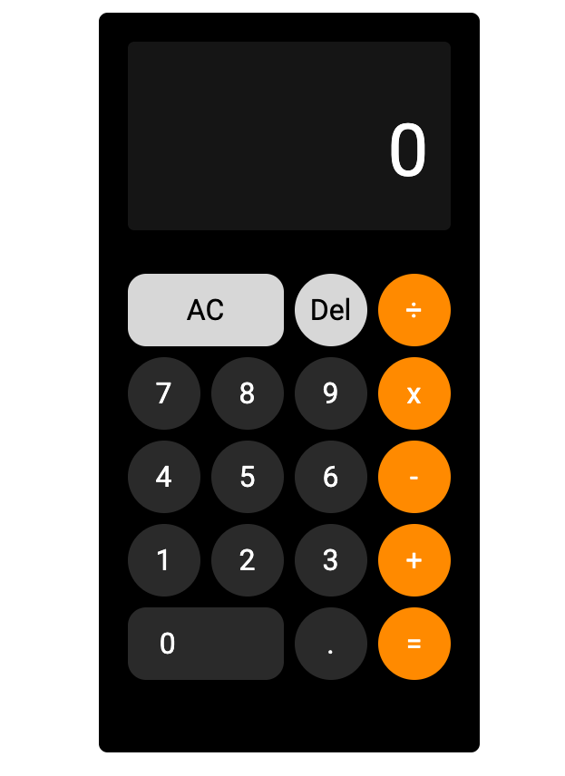

# JS-Calculator-Challenge-May-22

## Technology Consultancy 12 week programme at \_Nology.io.

### Week 3 project

Build a working calculator using vanilla Javascript, SCSS and BEM.

Next steps :

Implement the delete button, to remove the last item from the currentValue string.

Enable chaining of operations (calculations performed without hitting the equals button)

